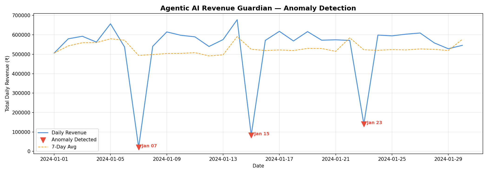

# 🤖 Agentic AI Revenue Guardian
### By Durgesh Rakhame | Data Analyst Portfolio Project

---

## 📌 What This Project Does

Most analytics tools **wait for a human to ask a question.**
This system **proactively monitors sales data**, detects revenue anomalies using Machine Learning, and **autonomously generates a plain-English business alert** by correlating the drop with web server error logs — all without any human input.

That **Perceive → Reason → Decide → Act** loop is what makes it an **AI Agent.**

---

## 📊 Output — Anomaly Detection Chart

The chart below was generated automatically by the project. The 3 red arrows mark the exact dates where revenue crashed — detected purely by the ML model, no manual checking.



| Date | Revenue Drop | Root Cause Detected |
|------|-------------|-------------------|
| Jan 07 | 95.8% drop | 404 errors — product page not found |
| Jan 15 | 84.1% drop | 500 errors — payment gateway crash |
| Jan 23 | 73.2% drop | 503 errors — cart API timeout |

---

## 🤖 Sample Agent Output

```
━━━ INVESTIGATING: 2024-01-07 ━━━
   Revenue: ₹20,779  |  7-day avg: ₹4,93,700  |  Drop: 95.8%
   [Agent] Querying error logs...
   [Agent] Top error: 404_NOT_FOUND on /product/wireless-earbuds (14,816 errors)
   [Agent] Building LLM prompt...

   📢 BUSINESS ALERT GENERATED:
   ──────────────────────────────────────────────────
   On 2024-01-07, daily revenue dropped by 96% vs the
   7-day average, representing a critical revenue loss.
   Web server logs show 14,816 x 404 errors on the product
   page — customers simply could not find the item.
   Immediate action: restore the product page URL and roll
   back the last deployment within 30 minutes.
   Severity: CRITICAL
   ──────────────────────────────────────────────────
```

---

## 🗂️ Project Structure

```
revenue_guardian/
│
├── 1_schema.sql              → SQL: 3-table database schema
├── 2_data_generator.py       → Generates 30 days of sales + error log data
├── 3_anomaly_detection.py    → Isolation Forest ML anomaly detection
├── 4_agent.py                → Agentic LLM alert generator
├── anomaly_chart.png         → Auto-generated output chart
└── README.md                 → This file
```

---

## ▶️ How to Run (4 commands)

```bash
# Step 1 — Install libraries
pip install pandas numpy scikit-learn matplotlib openai

# Step 2 — Generate data
python 2_data_generator.py

# Step 3 — Detect anomalies
python 3_anomaly_detection.py

# Step 4 — Run the AI agent (no API key needed)
python 4_agent.py --provider demo
```

---

## 🛠️ Tech Stack

| Tool | Purpose |
|------|---------|
| Python | Core language |
| Pandas / NumPy | Data manipulation |
| Scikit-learn | Isolation Forest anomaly detection |
| Matplotlib | Chart generation |
| OpenAI / Gemini API | LLM-powered alert generation |
| SQL (PostgreSQL) | Database schema design |

---

## 🧠 Why This Is "Agentic"

| Agent Property | What This Project Does |
|---------------|----------------------|
| **Perceive** | Reads live sales + error log data automatically |
| **Reason** | Isolation Forest scores and ranks anomalies |
| **Decide** | Flags suspicious dates with no human input |
| **Act** | Queries logs + calls LLM + generates business alert |

---

## 💡 Key Concept — What is a "Silent Killer" Product?

A product that is **not out of stock** but has a **sudden unexplained drop in sales** — something traditional dashboards miss completely. This agent catches it automatically.

---

*Built by Durgesh Rakhame as a portfolio project to demonstrate end-to-end Data Analytics + AI Agent skills.*  
*Tools: Python • Scikit-learn • OpenAI API • SQL • Matplotlib*
